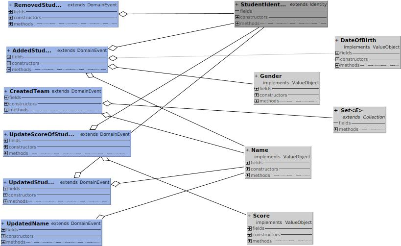

## Training Demo
En este ejemplo usando DDD para poder implementar un un subdominio de entrenamiento para equipos de desarrollo de software.

Se descrubren inicialmente 3 agregados fundamentales para el desarrollo del mismo. Los equipos, las rutinas y el dojo.

#### Motivo

Este proyecto es para comprender y diseñar software a partir de una base de desarrollo que nos orienta y nos facilita la parte táctica de DDD.

La dependencia es la siguiente:

```    
<dependency>
     <groupId>co.com.sofka</groupId>
    <artifactId>domain</artifactId>
    <version>0.3.5</version>
</dependency>
```

#### Importante

*En este proyecto solo se debe implementar la parte del dominio*

### Subdominio core - Training


### Modelo de dominio


### Event Storming

#### Agregado Team

##### Eventos

